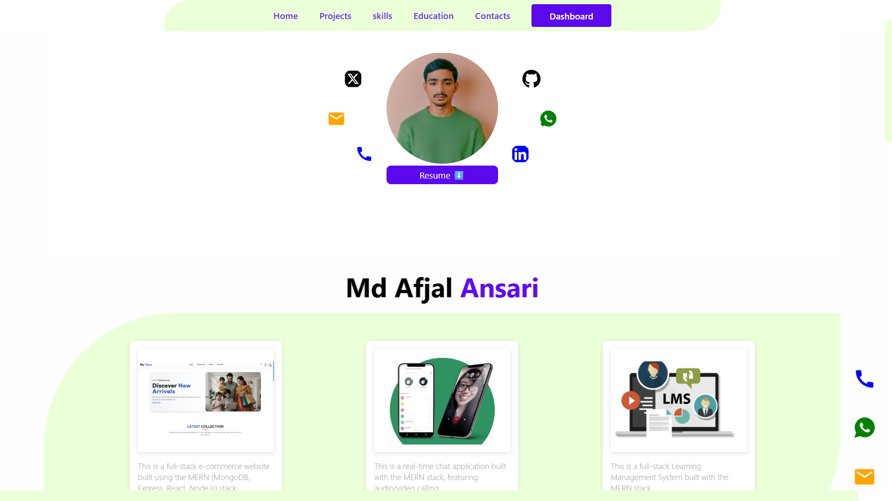
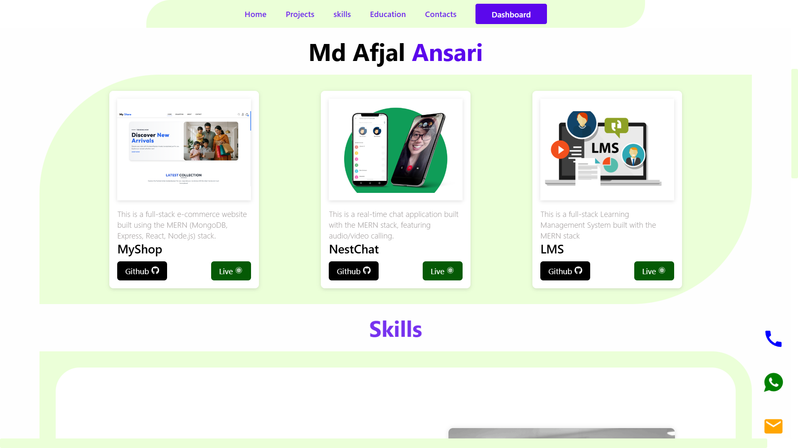
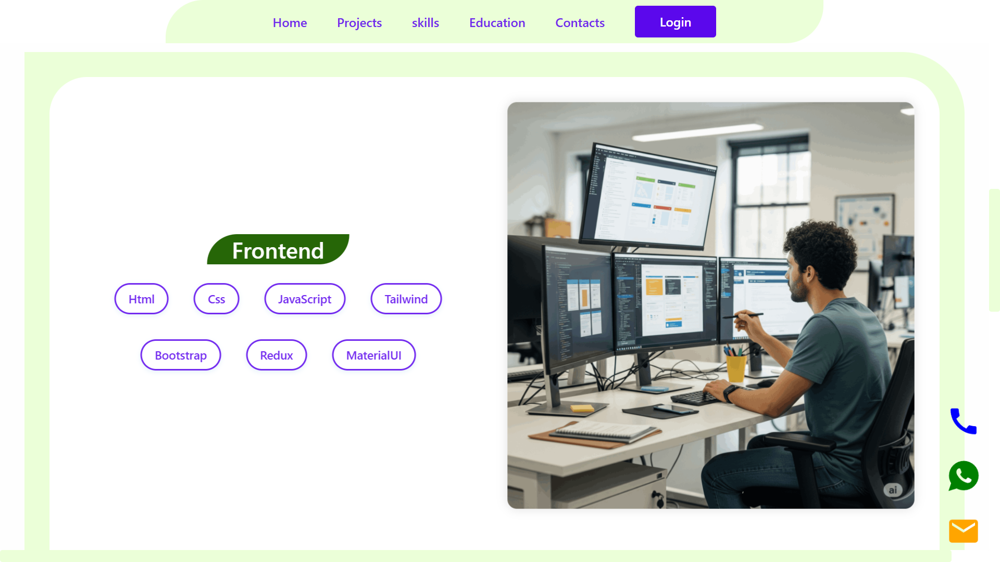
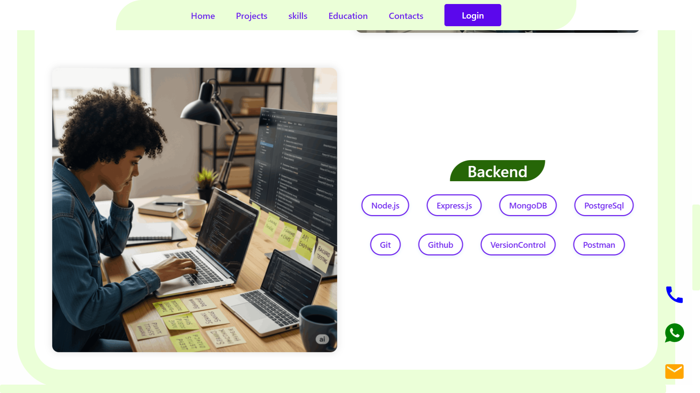
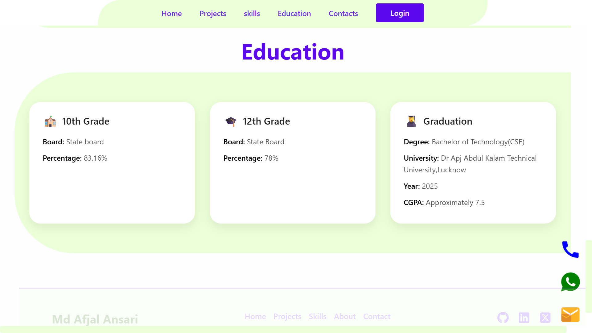

# 🧑‍💻 Afzal's Developer Portfolio

Welcome to my personal developer portfolio! This is a full-stack project that showcases my work, skills, and experience in web development using the **MERN stack**.

 
 
 
 
 

## 🌐 Live Demo

👉 [Visit Portfolio](https://md-afjal-ansari.onrender.com)

---

## ✨ Features

- 🌟 Home page with animated hero section
- 💼 Project showcase with GitHub and live demo links
- 🛠️ Skills and technologies used
- 📧 Contact form (connected to backend / email API)
- 🔐 Authentication (optional: admin login for adding projects)
- 📱 Fully responsive design

---

## 🛠 Tech Stack

### Frontend:
- React
- Vite
- React Router
- CSS (custom or utility-based)

### Backend:
- Node.js
- Express.js
- MongoDB (Mongoose)
- Multer (for image uploads)

### Other:
- React Toastify
- dotenv for env management
- Render (for hosting backend)
- Vercel / Netlify (for frontend)

